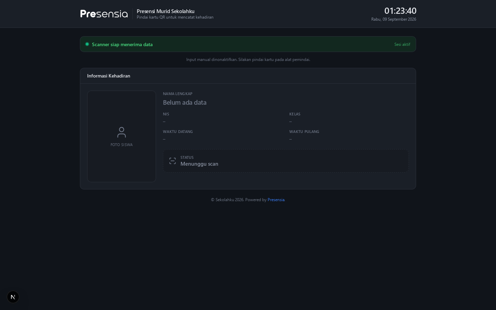
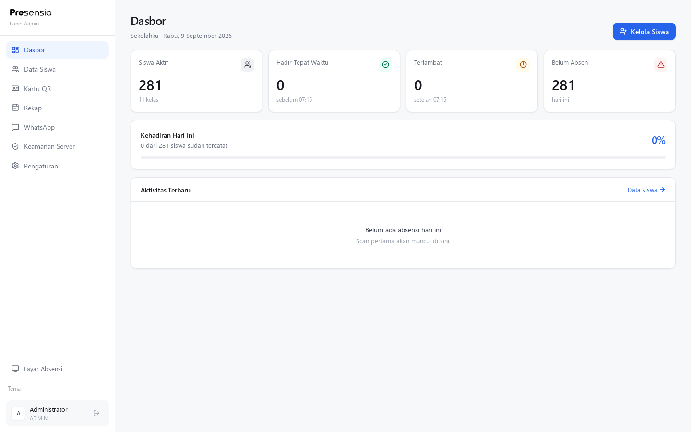
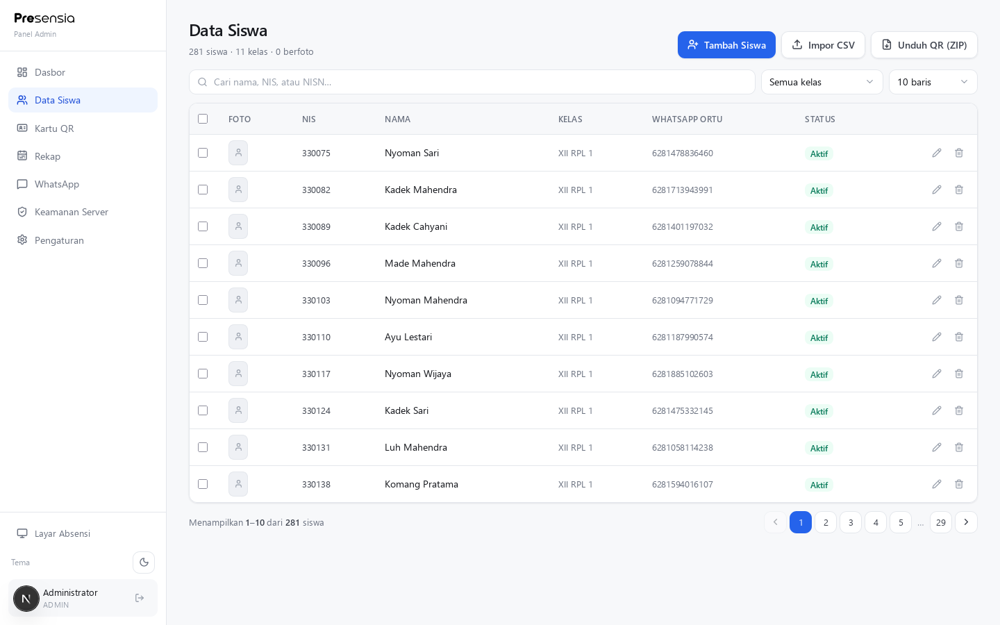
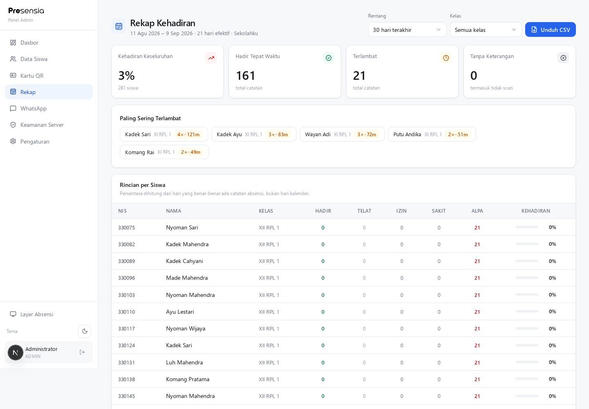
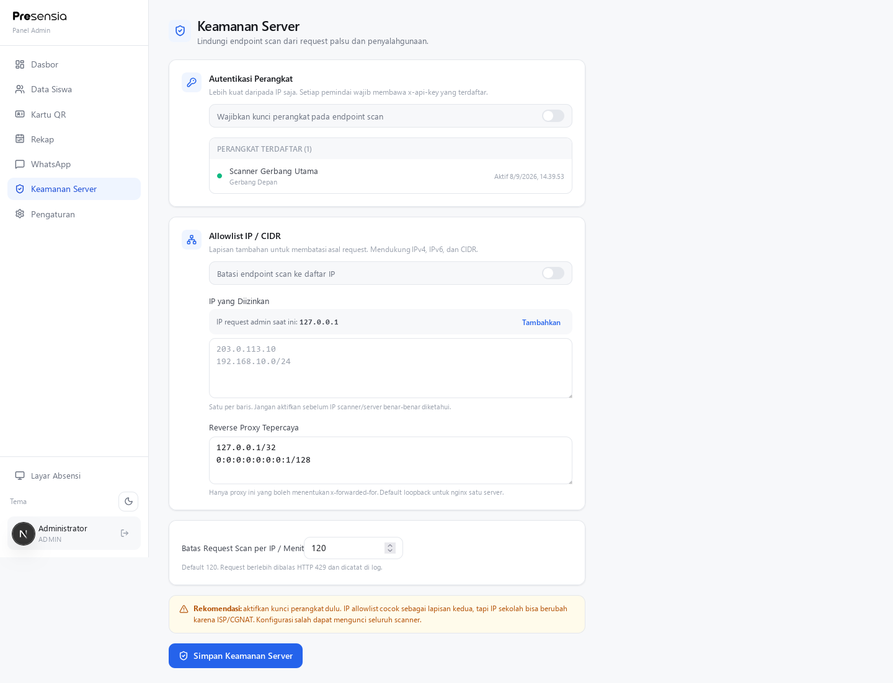
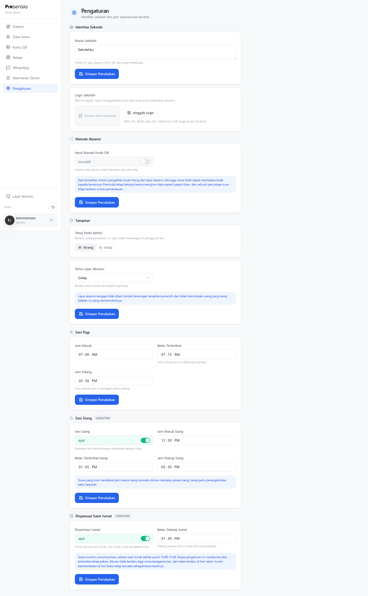

# Presensia

<p align="center">
  
</p>

<p align="center">
  Sistem absensi sekolah berbasis QR dengan layar kiosk real-time, panel admin,
  rekap kehadiran, notifikasi WhatsApp, dan keamanan perangkat.
</p>

<p align="center">
  <a href="#fitur">Fitur</a> ·
  <a href="#instalasi">Instalasi</a> ·
  <a href="#setup-awal">Setup Awal</a> ·
  <a href="#checklist-production">Production</a> ·
  <a href="#keamanan-endpoint-scan">Keamanan</a>
</p>

> Presensia adalah proyek open-source independen dan tidak berafiliasi dengan sekolah tertentu.



## Preview

| Panel Admin | Data Siswa |
|---|---|
|  |  |

| Rekap Kehadiran | Keamanan Server |
|---|---|
|  |  |

<details>
<summary>Preview halaman pengaturan</summary>



</details>

## Fitur

### Layar Absensi (Kiosk)

- QR scanner **keyboard-wedge**: scanner USB 2D terbaca seperti papan ketik, tanpa SDK vendor.
- Polling hasil scan terbaru agar scan dari device/API lain langsung tampil di layar.
- Menampilkan foto, nama, NIS, kelas, waktu datang/pulang, dan status valid/gagal.
- NISN hanya muncul jika diisi; nomor WhatsApp orang tua tidak pernah dikirim ke layar publik.
- Input kode manual dapat diaktifkan/nonaktifkan dari panel admin.
- Logo sekolah kustom; bila belum ada, marka Presensia dipakai sebagai default.
- Tema kiosk terang/gelap diatur terpusat oleh admin.

### Data Siswa dan QR

- Tambah/edit/hapus siswa, foto langsung disimpan ke PostgreSQL (`bytea`).
- Foto otomatis diputar, dipotong rasio 3:4, dikompres JPEG 480×640, dan metadata EXIF dibuang.
- QR dibuat otomatis dengan format bertanda tangan HMAC-SHA256:

  ```text
  PRS1.<nis>.<nonce>.<signature>
  ```

- Regenerasi QR mencabut kartu lama seketika.
- Import massal CSV dengan laporan baris rusak dan pencegahan NIS duplikat.
- Download massal ZIP: nama file QR mengikuti NIS dan dikelompokkan per kelas.
- Pagination 10/25/50/100, pencarian nama/NIS/NISN, filter kelas, skeleton loading, dan bulk delete.
- Pilihan enam agama: Islam, Kristen, Katolik, Hindu, Buddha, Khonghucu.

### Absensi dan Jadwal

- Scan masuk/pulang, anti-duplikat melalui unique constraint siswa + tanggal.
- Status: hadir, terlambat, izin, sakit, dan alpa.
- Sesi pagi dan sesi siang dengan jam masuk/telat/pulang masing-masing.
- Dispensasi salat Jumat khusus siswa Islam pada sesi siang; tidak berlaku di hari lain atau agama lain.
- Audit trail setiap percobaan scan, termasuk request ditolak.

### Rekap

- Rentang 1, 7, 14, 30, 90, 180, dan 365 hari.
- Filter kelas, statistik per siswa, persentase kehadiran, dan daftar siswa paling sering terlambat.
- Hari efektif dihitung dari tanggal yang benar-benar memiliki aktivitas sekolah, bukan seluruh hari kalender.
- Export CSV UTF-8 yang siap dibuka di Excel/Google Sheets.

### WhatsApp

- Outbox asynchronous: request scan tetap cepat walau gateway WhatsApp lambat.
- Notifikasi hadir dan terlambat ke nomor orang tua.
- Template pesan, URL gateway, token, antrean, retry, dan monitor status.
- Worker dapat dijalankan berkala menggunakan cron.

### Keamanan

- Session JWT dalam cookie `HttpOnly` + `SameSite=Lax`.
- Device API key per scanner; dapat diwajibkan untuk semua request `/api/scan`.
- Allowlist IPv4/IPv6/CIDR sebagai lapisan tambahan.
- Trusted reverse proxy: `X-Forwarded-For` hanya dipercaya dari proxy yang didaftarkan.
- Custom server menangkap peer TCP asli dan menimpa header internal agar tidak bisa dipalsukan klien.
- Rate limit per IP, audit log, QR HMAC, token revocation, dan validasi server-side.

## Stack

- Next.js 15 App Router + React 19 + TypeScript 5
- Tailwind CSS 4
- Prisma 6 + PostgreSQL
- Sharp untuk olah foto/logo
- JOSE (JWT), bcryptjs, Zod, QRCode, JSZip, ipaddr.js
- PM2 atau systemd untuk proses production

## Persyaratan

- Node.js 20+ (direkomendasikan Node.js 22 LTS)
- PostgreSQL 15+
- npm 10+
- Reverse proxy (nginx/Caddy) dan domain untuk production
- Scanner **2D imager** jika memakai perangkat fisik; scanner laser 1D tidak dapat membaca QR

## Instalasi

```bash
git clone https://github.com/rvieshh/presensia.git
cd presensia
npm install
cp .env.example .env
```

Buat database dan role PostgreSQL. Contoh:

```sql
CREATE ROLE presensia LOGIN PASSWORD 'GANTI_PASSWORD_DATABASE';
CREATE DATABASE presensia OWNER presensia;
ALTER ROLE presensia CREATEDB;
```

`CREATEDB` diperlukan Prisma Migrate ketika development memakai shadow database. Pada production yang hanya menjalankan `prisma migrate deploy`, hak tersebut dapat dicabut setelah migrasi.

Isi `.env` dan generate secrets **berbeda**:

```bash
openssl rand -base64 48   # JWT_SECRET
openssl rand -base64 48   # QR_SECRET
openssl rand -hex 32      # DEVICE_API_KEY (opsional)
```

Jalankan migrasi dan bootstrap:

```bash
npm run setup
npm run build
npm start
```

`npm run setup` hanya membuat pengaturan awal, satu akun admin dari `.env`, dan device jika `DEVICE_API_KEY` diisi. **Tidak ada siswa, kelas, absensi, atau data dummy.**

Buka:

- Kiosk: `http://localhost:3900/`
- Login admin: `http://localhost:3900/masuk`
- Panel admin: `http://localhost:3900/admin`

## Setup Awal

Setelah login pertama:

1. **Pengaturan → Identitas Sekolah**
   - Isi nama sekolah dan upload logo.
2. **Pengaturan → Sesi Pagi/Siang**
   - Atur jam masuk, batas terlambat, jam pulang, dan dispensasi Jumat bila diperlukan.
3. **Data Siswa**
   - Tambah manual atau import CSV.
4. **Kartu QR**
   - Cetak kartu atau download ZIP QR massal.
5. **WhatsApp**
   - Isi gateway/token, sesuaikan template, dan tes antrean.
6. **Keamanan Server**
   - Daftarkan device, aktifkan device API key, lalu pertimbangkan IP allowlist.

Format CSV:

```csv
nis,nama,kelas,wa_ortu,foto_url
2025001,Nama Siswa Pertama,X RPL 1,081234567001,
2025002,Nama Siswa Kedua,X RPL 2,081234567002,
```

Kolom wajib: `nis`, `nama`, `kelas`. Nomor `08...` otomatis dinormalisasi menjadi `62...`.

## Keamanan Endpoint Scan

Proteksi yang direkomendasikan:

1. **Wajibkan device API key** — lapisan utama. IP bisa berubah karena ISP/CGNAT.
2. **IP/CIDR allowlist** — lapisan tambahan setelah IP scanner/server dipastikan stabil.
3. **Rate limit** — default 120 request per IP per menit.
4. **Trusted proxy** — default `127.0.0.1/32` dan `::1/128` untuk nginx pada mesin yang sama.

Contoh request device:

```bash
curl -X POST https://presensi.example.sch.id/api/scan \
  -H 'Content-Type: application/json' \
  -H 'x-api-key: DEVICE_API_KEY_ANDA' \
  -d '{"qr":"PRS1.2025001.NONCE.SIGNATURE"}'
```

Jangan menjadikan IP allowlist satu-satunya autentikasi: IP dapat berubah, dipakai bersama, atau berada di belakang CGNAT.

## Reverse Proxy nginx

```nginx
server {
    listen 443 ssl http2;
    server_name presensi.example.sch.id;

    # sertifikat TLS (gunakan Certbot/acme.sh)
    ssl_certificate     /etc/letsencrypt/live/presensi.example.sch.id/fullchain.pem;
    ssl_certificate_key /etc/letsencrypt/live/presensi.example.sch.id/privkey.pem;

    client_max_body_size 10m;

    location / {
        proxy_pass http://127.0.0.1:3900;
        proxy_http_version 1.1;
        proxy_set_header Host $host;
        proxy_set_header X-Real-IP $remote_addr;
        proxy_set_header X-Forwarded-For $proxy_add_x_forwarded_for;
        proxy_set_header X-Forwarded-Proto $scheme;
    }
}
```

Dengan nginx satu server, pertahankan trusted proxy loopback. Jangan masukkan `0.0.0.0/0` sebagai trusted proxy.

## Menjalankan dengan PM2

```bash
npm install -g pm2
pm run build
pm2 start server.cjs --name presensia --time
pm2 save
pm2 startup
```

## Worker WhatsApp

```bash
# Tes manual
npm run cron:wa

# Setiap 2 menit
*/2 * * * * cd /path/presensia && /usr/bin/npm run cron:wa >> /var/log/presensia-wa.log 2>&1
```

## Checklist Production

Sebelum membuka aplikasi ke internet:

- [ ] Ganti semua nilai `CHANGE_ME` di `.env`.
- [ ] Gunakan `JWT_SECRET` dan `QR_SECRET` berbeda, acak, minimal 48 byte.
- [ ] Gunakan password database dan admin yang kuat.
- [ ] Jalankan di belakang HTTPS; set `COOKIE_SECURE=true`.
- [ ] Jangan expose PostgreSQL (`5432`) ke internet.
- [ ] Aktifkan device API key; uji scanner sebelum menyalakan IP allowlist.
- [ ] Pastikan trusted proxy hanya berisi IP reverse proxy yang benar.
- [ ] Backup PostgreSQL dan uji proses restore.
- [ ] Pasang PM2/systemd agar aplikasi otomatis hidup setelah reboot.
- [ ] Batasi akses admin dengan firewall/VPN bila memungkinkan.
- [ ] Jalankan `npm audit` dan update dependency secara berkala.
- [ ] Ganti/rotasi device key jika dicurigai bocor.

## Perintah

```bash
npm run dev         # development :3900
npm run build       # production build
npm start           # custom production server (peer-IP aware)
npm run setup       # migrate + bootstrap admin/settings
npm run seed        # bootstrap idempotent
npm run cron:wa     # kirim antrean WhatsApp
npm run reset:data  # HAPUS data operasional, pertahankan admin + schema
```

## Catatan Data dan Privasi

- `.env` diabaikan Git; hanya `.env.example` yang masuk repository.
- Database PostgreSQL, foto siswa, nomor orang tua, dan log scan tidak disimpan di Git.
- Jangan commit hasil dump database, kartu QR hasil produksi, foto siswa, atau screenshot yang memuat PII.
- `prisma/seed-riwayat.ts` adalah generator data development; jangan jalankan di production.

## Lisensi

MIT
